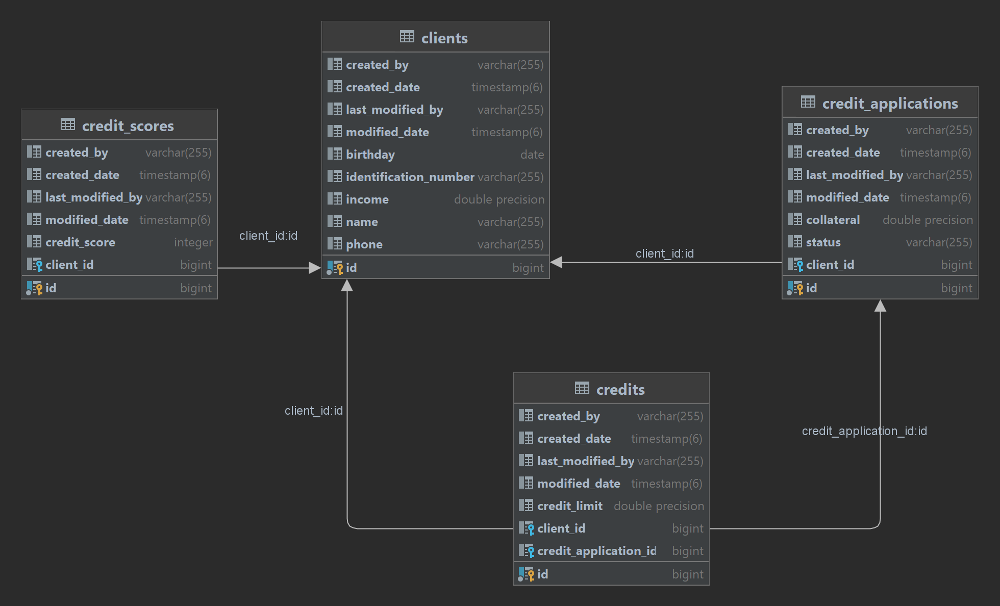

# CreditApplicationSystem

Credit Application System using Java & Spring Boot

## Used Technologies & Architecture

- Java 17
- Monolithic Architecture
- Spring Boot 3.0.1
- Spring Security
- Postgres
- OpenAPI
- Apache Kafka
- Kafka UI
- Redis
- Docker
- Docker Compose

## How to Run Application

Prerequisites to Run:

- Docker Engine
- Docker Compose

Step 1:\
You should clone the project into your local machine.

Clone With HTTPS:
- `git clone https://github.com/fcesur/CreditApplicationSystem.git`

Step 2:
- Run command to build images and run the containers\
`docker-compose up`

## Swagger Endpoint

- http://localhost:8086/swagger-ui/index.html

## Database ERD

